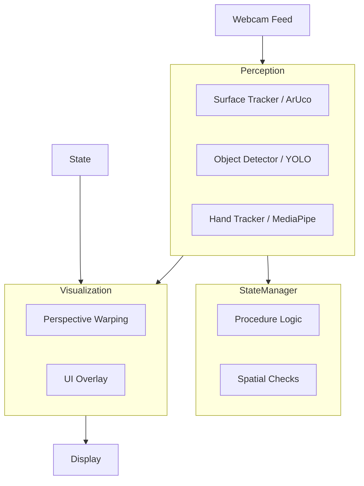

# Implementation Plan - Physical Task Guidance System

## Goal
Build a prototype Python application that perceives the real world triggers via webcam, tracks table boundaries and objects, and guides a user through a physical sorting task using Augmented Reality (AR) overlays.

## User Review Required
> [!IMPORTANT]
> **Tech Stack Selection**: I represent the detection module using **YOLOv8** (via `ultralytics`) for object detection as it is robust against occlusion and lighting changes compared to simple color segmentation. For surface tracking, I will use **ArUco Markers** (OpenCV default) as they are reliable for defining coordinate systems.
> **Hardware**: The system assumes a standard webcam is available at index 0 or 1.

## Architecture Overview
The system will run a main loop that captures video frames, processes them through three distinct pipelines, and composites the result.

## Proposed Technologies
- **Language**: Python 3.9+
- **Core Vision**: `opencv-python` (cv2)
- **AI/ML**: 
    - `ultralytics` (YOLOv8) for robust object detection (Cup, Bottle, Plate).
    - `mediapipe` for Hand Tracking.
- **Math**: `numpy` for homography and matrix operations.

## Module Breakdown

### 1. Perception Module
Responsible for "seeing" the world.
- **SurfaceTracker**: 
    - Detects 4 ArUco markers placed at table corners.
    - Computes the **Homography Matrix** to map Screen Coordinates $(x,y)$ to Table Coordinates $(u,v)$.
    - Outputs: Valid workspace boolean, Homography matrix, Corner points.
- **ObjectDetector**:
    - Uses YOLOv8 pretrained on COCO (classes: cup, bottle, bowl/plate).
    - Outputs: List of detected objects with Bounding Boxes and Class IDs.
    - *Mapping*: Converts box center $(x,y)$ to logical table position using the Homography matrix.
- **HandTracker**:
    - Uses MediaPipe Hands.
    - Outputs: Hand landmarks. Used to infer if user is interacting (bonus feature).

### 2. State Management Module
Responsible for the "Brain" of the guided task.
- **Procedure Definition**:
    - A list of `Step` objects.
    - Example: `Step(object='cup', target_region=(0.2, 0.2, 0.4, 0.4))` (normalized table coords).
- **Logic**:
    - Inputs: Current object positions (mapped to table space).
    - Checks: Is `Current_Object` inside `Target_Region`?
    - Transitions: If Check is True for $N$ frames (debounce) -> Advance to next step.

### 3. Visualization Module
Responsible for feedback.
- **2D / 3D Projection**:
    - Instead of drawing flat rectangles on screen, we use `cv2.perspectiveTransform` to draw grid lines and target zones that look "painted" on the table.
- **Guidance**:
    - Draw a line/arrow from the specific object center to the target center.
    - Color coding: Red (Wrong place), Green (Correct place).
- **HUD**:
    - Text overlay at the top: "Step 1/3: Move the Cup".

## Verification Plan

### Automated Tests
- Identify if Camera source opens.
- Verify ArUco generation/detection logic on static test images.
- Verify YOLO model loads and detects standard objects in sample images.

### Manual Verification
1. **Calibration**: Print 4 ArUco markers, tape to desk. Run app, verify grid aligns with desk surface.
2. **Detection**: Place Cup, Bottle, Plate. Verify system labels them correctly.
3. **Workflow**:
    - Start App.
    - Move Cup to Target A -> Verify "Good Job" and transition to Step 2.
    - Block camera -> Verify robust recovery.
    - Move all items -> Verify "Table Set Successfully".
